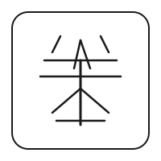

<div align="center">



# LingCode 灵码输入法

**A Rust-based Rime-compatible input method framework**

[](./README.md)
[](./README_CN.md)

[](https://www.rust-lang.org/)
[](./LICENSE)
[](https://rime.im/)

</div>

---

## ✨ Features

| Feature | Status | Description |
|---------|--------|-------------|
| 🎯 **Pinyin Input** | ✅ Ready | Simplified & Traditional Pinyin |
| ⌨️ **Double Pinyin** | 🚧 WIP | Natural Code, Flypy, MS Pinyin |
| 💻 **Cross-Platform** | 🚧 WIP | macOS, Windows, Linux, iOS, Android |
| 📚 **Rime-Compatible** | ✅ Ready | Use Rime schemas & dictionaries |
| 🧠 **Smart Learning** | 📋 Planned | Word frequency learning |
| 🔄 **OpenCC** | 📋 Planned | Simplified/Traditional conversion |

---

## 🚀 Quick Start

### Installation

```bash
# Clone the repository
git clone https://github.com/xiaoburen/LingCode.git
cd LingCode

# Build CLI demo
cargo build -p lingcode-cli --release

# Run
./target/release/lingcode
```

### Demo

```
╔══════════════════════════════════════════╗
║       📝 LingCode CLI Demo v0.1          ║
╠══════════════════════════════════════════╣
║  Type pinyin, press space/number to select║
║  Backspace: delete | Esc: cancel         ║
╚══════════════════════════════════════════╝

Input: zhongwen
Candidates: [1. 中文] 2. 中问 3. 中闻
Press 1 to commit: 中文
```

---

## 📁 Project Structure

```
LingCode/
├── crates/
│   ├── core/          # Core types and definitions
│   ├── engine/        # Input method engine (state machine)
│   ├── pinyin/        # Pinyin engine
│   ├── double-pinyin/ # Double pinyin support
│   ├── dict/          # Dictionary management (Rime-ice)
│   ├── converters/    # OpenCC integration
│   ├── ffi/           # FFI bindings
│   └── cli/           # Command-line demo
├── frontends/
│   └── desktop/
│       ├── macos/     # macOS input method
│       ├── windows/   # Windows input method
│       └── linux/     # Linux input method
└── resources/
    └── dict/          # Dictionary files (Rime-ice)
```

---

## 🛠️ Development Status

### Phase 1: Core Foundation ✅
- [x] Core types and definitions
- [x] Engine state machine (Idle→Composing→Selecting)
- [x] Simplified Pinyin engine
- [x] CLI demo with real input

### Phase 2: Feature Enhancement ✅
- [x] Load Rime-ice dictionaries (8105 chars + base + ext + tencent)
- [x] Double pinyin support (Flypy, Natural Code, MS Pinyin)
- [x] Word frequency learning with UserDict
- [x] Simplified/Traditional conversion (OpenCC)

### Phase 3: Cross-Platform Frontend 🚧
- [x] FFI bindings (C API)
- [x] macOS input method (InputMethodKit)
- [x] Connect to real Rust engine via FFI
- [ ] Windows input method (TSF)
- [ ] Linux input method (IBus/Fcitx)

**Status**: Core library complete, macOS frontend framework ready. Project paused for testing.

---

## 📚 Dictionary

LingCode uses **[Rime-ice](https://github.com/iDvel/rime-ice)** as the default dictionary:

- **8105.dict.yaml** - 8105 standard Chinese characters
- **base.dict.yaml** - Base vocabulary
- **ext.dict.yaml** - Extended vocabulary
- **tencent.dict.yaml** - Tencent word list

Dictionary location: `~/Library/Rime/cn_dicts/` (macOS)

---

## 🤝 Contributing

Contributions are welcome! Please feel free to submit an [Issue](https://github.com/xiaoburen/LingCode/issues) or [Pull Request](https://github.com/xiaoburen/LingCode/pulls).

---

## 🙏 Acknowledgments

This project is inspired by and compatible with:

- [Rime Input Method](https://rime.im/) - The ultimate input method framework
- [Rime-ice](https://github.com/iDvel/rime-ice) - A comprehensive Rime dictionary

This project is developed using [OpenClaw](https://github.com/openclaw/openclaw) - A personal AI assistant framework for long-running agent workflows.

---

## 📄 License

Licensed under the [Apache License 2.0](./LICENSE).

---

<div align="center">


**LingCode - Making Chinese input smoother**

[](https://github.com/xiaoburen/LingCode)
[](https://github.com/xiaoburen/LingCode)

</div>
